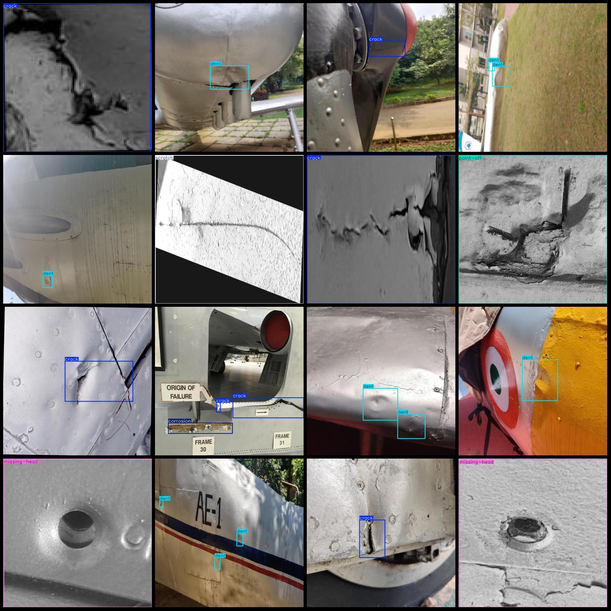
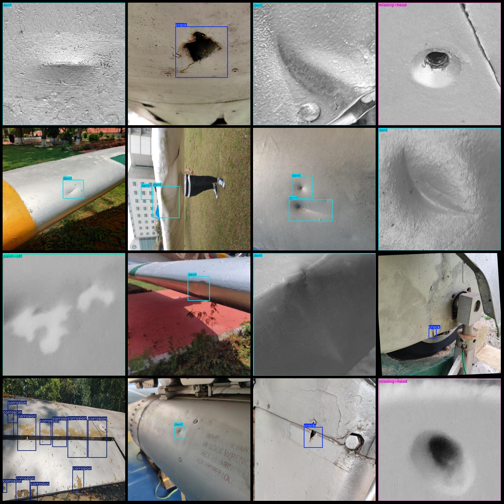

# Airplane Surface Defect Detection Dataset VOC+YOLO Format with 3718 Images in 6 Categories

Please note that the dataset contains a large number of enhanced images, mainly rotation enhancements.
Dataset format: Pascal VOC format + YOLO format (txt file without split paths, only containing jpg images and corresponding VOC format xml files and yolo format txt files).
Number of images (jpg file count): 3718
Number of labels (xml file count): 3718
Number of labels (txt file count): 3718
Number of label categories: 6
Label category names (notice that the order of yolo format categories does not correspond to this, but refer to the labels folder's classes.txt for accuracy): ["corrosion", "crack", "dent", 
"missing-head", "paint-off", "scratch"]
Number of bounding boxes per category:
Corrosion bounding boxes: 531, occupying images: 288
Crack bounding boxes: 1265, occupying images: 1163
Bounding box = 1840, occupying images = 1436
Missing-head (Head missing) bounding boxes = 470, occupying images = 470
Paint-off (Paint peeling) bounding boxes = 406, occupying images = 406
Scratch (scratching) bounding boxes = 111, occupying images = 111
Total bounding boxes: 4623
Image resolution: 640x640
Annotation tool used: labelImg
Annotation rules: draw rectangle boxes for each category
Important Notice: The dataset does not have separate training validation test sets; you need to manually divide them.
Special Declaration: This dataset does not guarantee any accuracy of the trained models or weight files.
Image Preview:
## Images

Here is a pay link on Stripe ( https://buy.stripe.com/3cs8yP7sY87d0vu9AB ). Please contact me lonlonago@foxmail.com after funding $89, and I will send you a complete data files , thank you!

